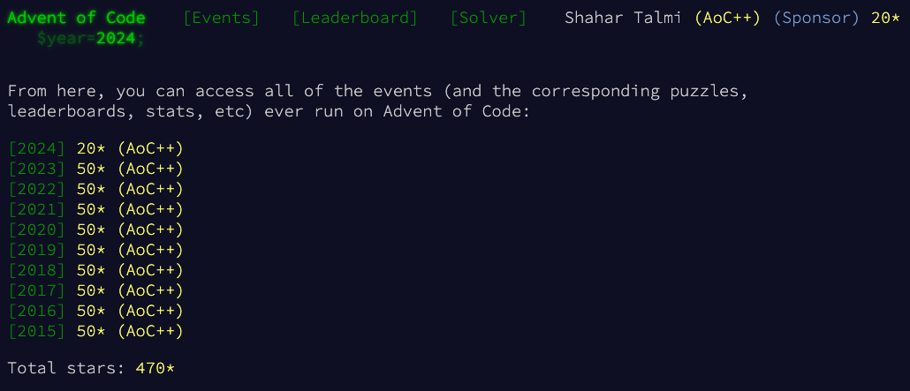
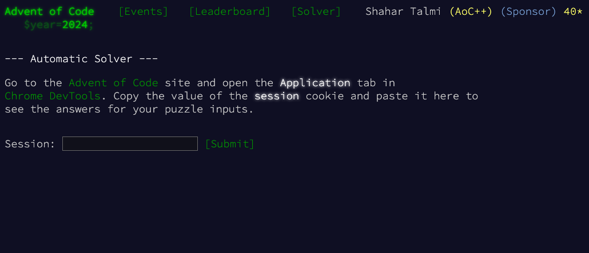

# Advent of Code - Solver [](#advent-of-code---solver-)

This repository contains solutions for advent of code (https://adventofcode.com)



Go ahead and try to solve the challenge on your own before using this spoiler!

In order to use this solver simply go to: https://shahata.github.io/adventofcode-solver/ choose an year and follow the instructions.

[](https://shahata.github.io/adventofcode-solver/)

Alternatively, if you don't want to share your cookie value online or if some solutions fail to run in the browser, simply clone this git and run the following commands. Note this requires node@19 or newer.

```sh
$ git clone git@github.com:shahata/adventofcode-solver.git
$ cd adventofcode-solver

$ npm install
$ export ADVENT_SESSION=your-cookie-value

$ npm start [year]
```

The commands above will work for all years since 2015.
